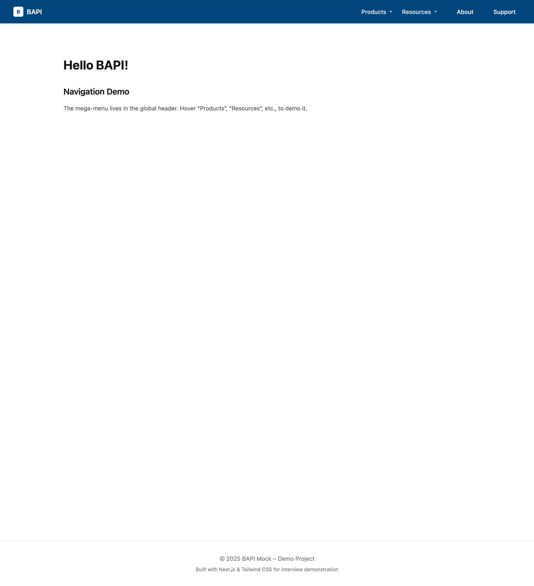
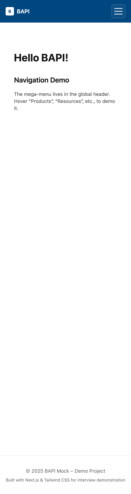

# BAPI Mega Menu Demo

A modern proof-of-concept navigation system built with **Next.js 15**, **React + TypeScript**, and **Tailwind CSS v3**.  
This project demonstrates a scalable, data-driven mega-menu for BAPI-style product families, optimized for **speed, accessibility, polish, and maintainability**.

---

---

## 📸 Preview

### Desktop

### Mobile

## 🚀 Tech Stack
- Next.js 15 (App Router, TypeScript)
- React 18/19 compatible
- Tailwind CSS **3.4.x** (stable)
- clsx + tailwind-merge (clean class composition)

---

## ✅ Features
- Responsive **mega-menu** with split top-level product families (Temperature, Humidity, Pressure, Air Quality, Accessories) plus Applications, Resources, Support, About
- **Keyboard-friendly & accessible**: focus states, large hit areas, escape-to-close, semantic landmarks
- **Mobile drawer** with polished hamburger → X animation, bounce interactions, and motion-safe transitions
- **Desktop mega-menu** panels anchored to the header container with clamped width — no overflow at any breakpoint
- **Performance-minded**: utility-first CSS; minimal JS
- **Analytics-ready**: `data-analytics="nav:Section:Item"` attributes for GA4/GTM mapping
- Clean, **pro-level project structure** for easy scaling
- Includes reusable **Navigation Primitives** (`NavTrigger`, `MegaPanel`) for future projects

---

